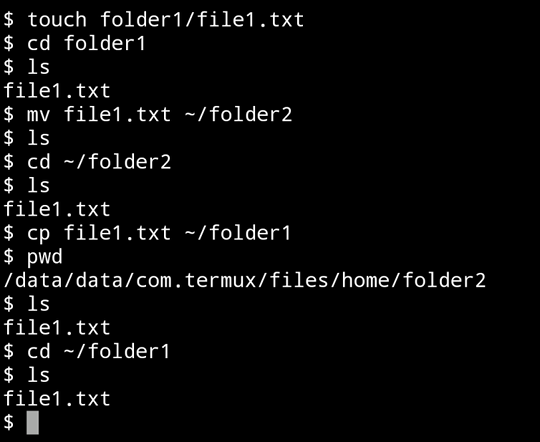

The command<kbd>
 touch
</kbd> creates an empty file. We have started in the home directory so the new file will be one level down.

<kbd>
cd folder1
</kbd> takes us to the folder and ls shows the new file.

<kbd>mv file1.txt ~/folder2
</kbd> moves the folder to another subdirectory of the home folder. ls shows the file has moved. Another use of mv is to rename a file. For example  
    <kbd>mv file1.txt file2.txt</kbd>  will rename the file to file2.txt.

cd takes us to folder2 and we confirm the file is there. Copying the file is done like this: 
    <kbd>cp file1.txt ~/folder1</kbd>. Here the <kbd> ~/folder1</kbd>  is an absolute reference to /home/folder1

<kbd>
ls
</kbd> shows the file is in both directories
 