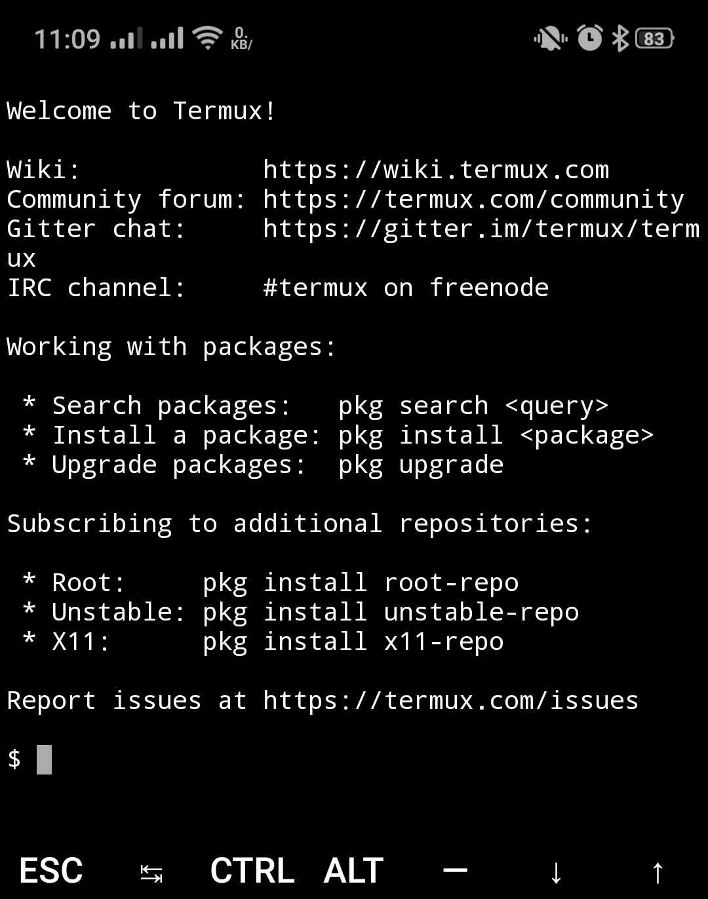

Termux is an open source Linux emulator running on Android. It allows you to become familiar with Linux commands by practising them on your phone from simple directory commands to updating your system and installing new programs.

===

    Termux can be installed like any other Android app by using the Playstore. The webpage for Termux is <a href="https://termux.com">https://termux.com</a>

When you open Termux, you have a command prompt shown by the dollar sign and the bottom of the screen are some often used keys. ESC, TAB (shown by left and right arrows), CTRL, ALT, - (dash key) and up and down arrows.

The first command is 

    $ exit<kbd></kbd>

This will log you out of the system. In this command I am showing the prompt as $. Type exit and press the enter key and Termux closes.

    Open Termux again and type

    $ EXIT  EXIT: Command not found

    Linux is case sensitive for all commands and filenames. exit and EXIT are not the same commands, file1.txt and File1.txt are different files

.