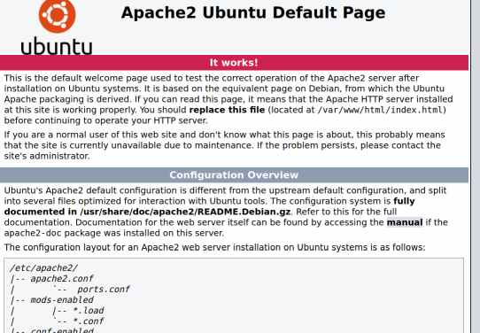

To install Apache, first update the system, then use apt to install Apache 2.

 

jimmy@vdsbasic:~$ sudo apt update 
jimmy@vdsbasic:~$ sudo apt install apache2 
Building dependency tree  
Reading state information... Done 
The following additional packages will be installed:  
apache2-bin apache2-data apache2-utils libapr1  libaprutil1 libaprutil1-dbd-sqlite3 libaprutil1-ldap  liblua5.2-0 ssl-cert 
......

ufw app list shows we have Apache installed and it is able to be accessed through the firewall.

 

jimmy@vdsbasic:~$ sudo ufw app list 
Available applications:  
Apache  
Apache Full  
Apache Secure  
OpenSSH 

ufw can also be used to check ports are open.

 

jimmy@vdsbasic:~$ sudo ufw app info "Apache Full" 
Profile: Apache Full 
Title: Web Server (HTTP,HTTPS) 
Description: 
Apache v2 is the next generation of the omnipresent Apache web server. 
 
Ports:  
80,443/tcp 

Check Apache is installed by going to your server address.Mine is a vdsbasic.xyz

  
    

    The file is located at /var/www/html/index.html and provides us with start and stop instructions:

 

Create your own index.html file.

sudo nano /var/www/html/index.html

<tt>&lt;html&gt;  &lt;body&gt;  Hello world!   &lt;/body&gt; &lt;/html&gt; </tt>
