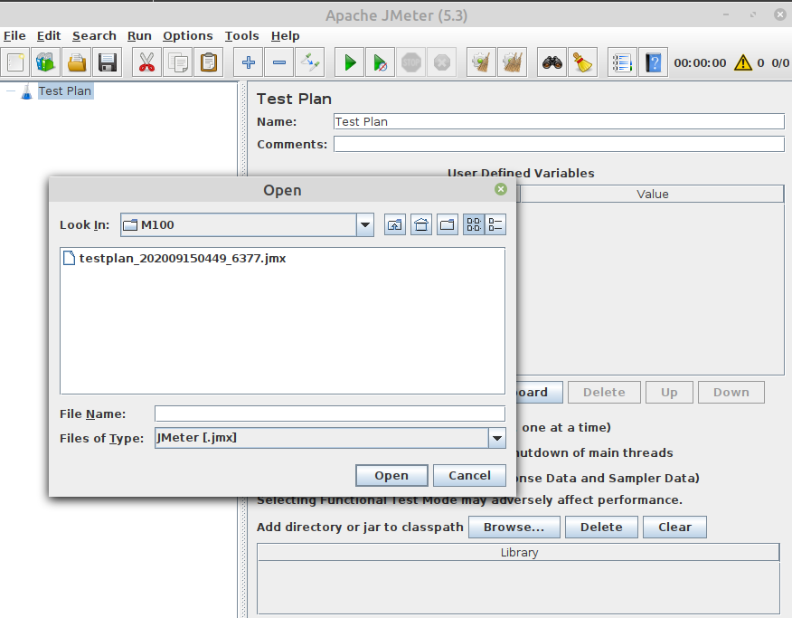

  Apache JMeter can be used to check speed on a Moodle install and see what performance gains can be made with different configurations. Do this only  when setting up as the load will kill performance on an Production Server. Also be careful on shared hosting as limits will soon be reached.

  First step on a clean Moodle Install is to create a test course.

   
<tt>  Dashboard -> Site administration ->  Development  -> Make test course</tt>
  
  
Start with XS or S, if the Jmeter tests run qickly then you can always step up.

 
<tt>  Dashboard -> Site administration ->  Development  ->  Make JMeter test plan</tt> 

  First you need to set a password for the course users in the config.php file in your Moodle code folder (e.g. $CFG->tool_generator_users_password = 'moodle';) 

 
Base the test plan on your new test course.

 
 
You should get two files to download, mine were called testplan_202009150449_6377.jmx and users_202009150449_9289.csv. Copy both to a machine runinng a GUI because jMeter will be run in GUI mode.

 

To install Jmeter go to <a href="http://jmeter.apache.org/download_jmeter.cgi">this downlaod page</a>. On my Linux machine I also had to install beanshell with:

<tt>sudo apt-get install bsh</tt>

Open JMeter and open your jmx file.

With the test plan loaded, go to the warmup site and Default Site Request set the protocol
Open JMeter and open your jmx file.
on the web server to http and the server name or IP to the websire address. Under CSV users data, set the filename to your CSV file.  

Right click the Test Plan at the top of the tree, select Add  and then Listener. Choose the top three  of View Results Tree, Summary Report and Aggregate Report.

 
 
