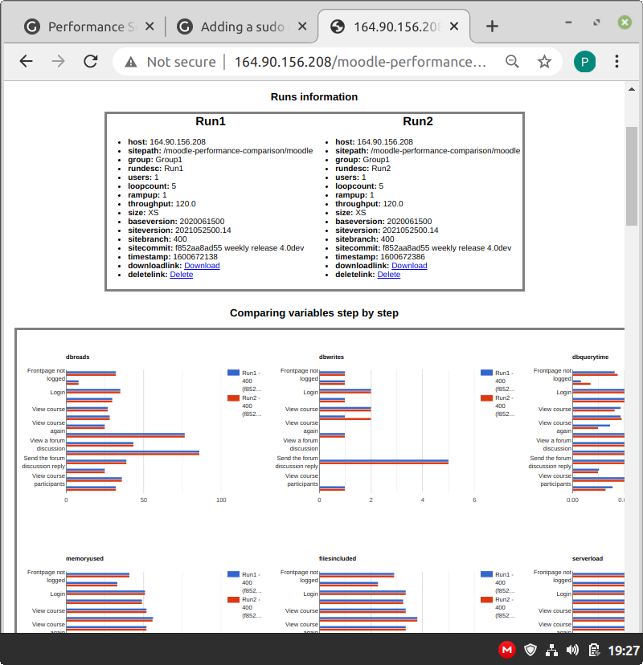

 
To run the Performance Tuning Scripts start with a clean install of a LAMP stack. The XS test will run on 1 CPU and 1 GB of RAM with 
a 1 GB swap file but you will need more grunt for a S or M test. I used the DigitalOCcean marketplace to 
load a fresh LAMP. Don't install Moodle.

First a sudo user. 
<tt>
<pre>
sudo adduser jimmy
sudo usermod -aG sudo jimmy
su jimmy
</pre>
</tt>

Swap File first. Simple rule is same amount as your RAM. 
<tt>
<pre>
sudo fallocate -l 1G /swapfile 
sudo chmod 600 /swapfile 
sudo mkswap /swapfile 
sudo swapon /swapfile 
sudo swapon --show
</pre>
</tt>

Write to your fstab table if you want to reboot and still have a swap file. 

Your LAMP should have php installed but add the bits and pieces Moodle needs. Check your php version first (php -version) as this installs the 7.4 version 
 

<tt>
<pre>
sudo apt install graphviz aspell ghostscript clamav php7.4-pspell php7.4-curl php7.4-gd php7.4-intl php7.4-mysql php7.4-xml php7.4-xmlrpc php7.4-ldap php7.4-zip php7.4-soap php7.4-mbstring
</pre>
</tt>

Create a database user with all privileges. There is no need to create a database. 
<tt>
<pre>
sudo mysql -u root

create user 'mpc'@'localhost' IDENTIFIED BY 'password';
GRANT ALL PRIVILEGES ON * . * TO 'mpc'@'localhost';
FLUSH PRIVILEGES;
exit;
</pre>
</tt>

Set up the wwwroot. In Debian based distros the wwwroot is /www/var/html but the Moodle Performance Scripts assume the root is in /var/www
Adjust the wwwroot by changing the DocumentRoot to /var/www/html to/var/www 
<tt>
<pre>
  sudo nano /etc/apache2/sites-available/000-default.conf  
</pre>
</tt>

Restart Apache. 
<tt>
<pre>
sudo service apache2 restart
</pre>
</tt>

Now create the dataroot and back up directory. 
<tt>
<pre>
sudo mkdir /var/moodledata
sudo chmod -R 777 /var/moodledata
mkdir /home/jimmy/backup
</pre>
</tt>

Now we have to install Java. 
<tt>
<pre>
sudo apt update
sudo apt install default-jre
</pre>
</tt>
Then Jmeter. 
<tt>
<pre>
cd /opt
sudo wget https://downloads.apache.org//jmeter/binaries/apache-jmeter-5.3.tgz
sha512sum apache-jmeter-5.3.tgz 
</pre>
</tt>
Check the SHA512 sum matches.
<tt>
<pre>
sudo tar xvf apache-jmeter-5.3.tgz 
</pre>
</tt>
Now install Moodle Performance Scripts. 
<tt>
<pre>
cd /var/www
sudo git clone git://github.com/moodlehq/moodle-performance-comparison.git moodle-performance-comparison
cd moodle-performance-comparison
sudo cp webserver_config.properties.dist webserver_config.properties
sudo cp jmeter_config.properties.dist jmeter_config.properties
</pre>
</tt>

Now edit the config files. If you have followed these directions for the webserver_config.properties use 
<tt>
<pre>
sudo nano webserver_config.properties

dbtype="mysqli"
dbhost="localhost"
dbuser="mpc"
dbpass="password"
wwwroot="http://(your ip address)/moodle-performance-comparison/moodle"
dataroot="/var/moodledata"
backupsdir="/home/jimmy/backup"
</pre>
</tt>

<tt>
<pre>
sudo nano jmeter_config.properties

jmeter_path=/opt/apache-jmeter-5.3
</pre>
</tt>

Now you are ready to run the scripts. The before script takes a single parameter, Always start with XS, Anything larger fails on a basic droplet. This 
script will run slowly as it uses git to download Moodle, installs Moodle and create courses. After the download there will be a Moodle subdirectroty 
which will hold some additional files - testplan.jmx, users.csv and siteproperties.config. 

<tt>
<pre>
cd /var/www/moodle-performance-comparison
sudo ./before_run_setup.sh XS
</pre>
</tt>
Once that is finsished, run restart_services.sh and test_runner.sh. The restart_services script takes no parameters,the
 test_runner.sh takes a rungroup and run label. .
<tt>
<pre>
sudo ./restart_services.sh
sudo ./test_runner.sh Group1 Run1
</pre>
</tt>

To run the next test, run after_run_setup.sh
<tt>
<pre>
sudo ./after_run_setup.sh
sudo ./test_runner.sh Group1 Run2
</pre>
</tt>

 Now navigate to the wwwroot http://(your ip)/moodle-performance-comparison and you should see a graphical represntation of your runs.  http://(your ip)/moodle-performance-comparison/moodle will be your test site. 

Now you can run experiment with adding more resourcdes before running  
<tt>
<pre>
sudo after_run.sh
sudo ./before_run_setup.sh S
</pre>
</tt>

The graphs produced look like this:  

